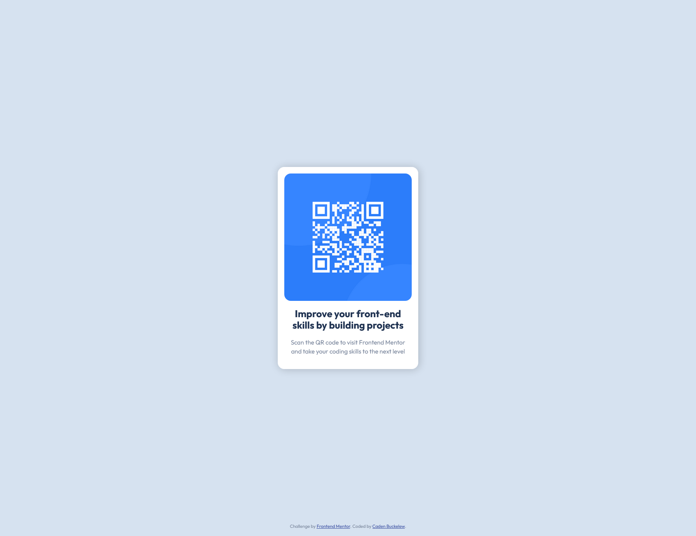

### Links

- Live Site URL: [https://buckelew.github.io/frontendmentor-qr-code/](https://buckelew.github.io/frontendmentor-qr-code/)

## My process

- Define html structure
- Define css variables
- Style using flexbox

### Built with

- Semantic HTML5 markup
- CSS custom properties
- Flexbox

### What I learned

I learned how to effectively use rems, ems, ch, and css custom properties.

```css
:root {
  --clr-white: hsl(0, 0%, 100%);
  --clr-light-grey: hsl(212, 45%, 89%);
  --clr-light-blue: hsl(220, 15%, 55%);
  --clr-dark-blue: hsl(218, 44%, 22%);

  --fw-body: 400;
  --fw-bold: 700;
}
```

### I plan to:

- Learn proper naming conventions for css custom properties;
- Incorporate more ems and rem units into future css projects.

### Useful resources

- [CSS Variables](https://www.youtube.com/watch?v=PHO6TBq_auI&t=405s) - This helped me learn css custom properties.
- [CSS em and rem explained](https://www.youtube.com/watch?v=_-aDOAMmDHI) [CSS Units](https://www.youtube.com/watch?v=N5wpD9Ov_To) - These both helped me understand more about css units, and explained how rem and ems worked.

## Author

- Website - [Caden Buckelew](https://cadenbuckelew.com)
- Frontend Mentor - [@Buckelew](https://www.frontendmentor.io/profile/Buckelew)
